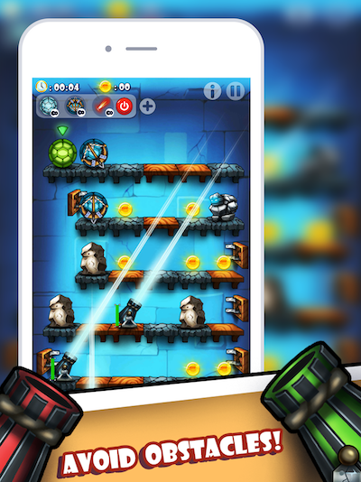

# TurtleSquad
First game on Unity3D Engine, 2D game about 4 turtles going through a maze of obstacles

## Links

Youtube - https://www.youtube.com/watch?v=3UbeWYjb57s&t=9s
IOS - https://goo.gl/61M2VV
Android - https://goo.gl/mZ0ZaY

## History

This is my first project on Unity Engine. The game originally was started on Corona SDK. Co-author of this game is my brother [AnvarArt] (https://github.com/AnvarArt).
It should've been a small simple game, but it turned out into a very big and complicated project.

### Installing

Repo includes only scripts.

## License

This project is licensed under the MIT License - see the [LICENSE.md](LICENSE.md) file for details
